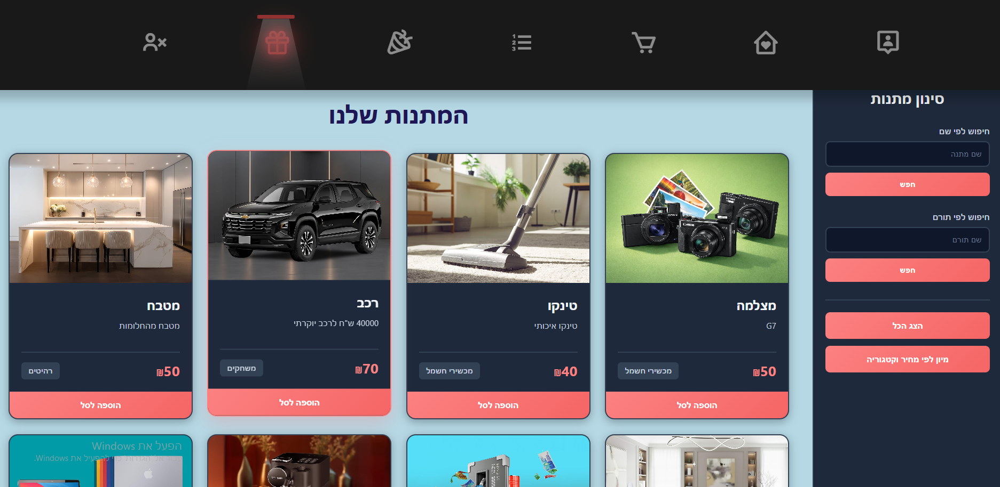
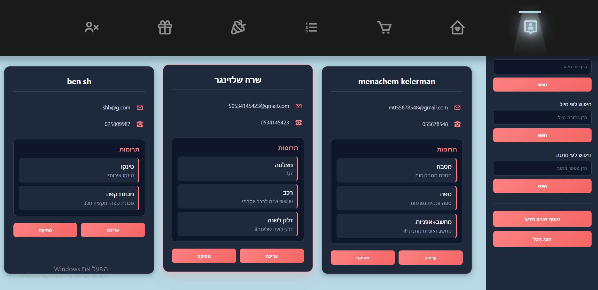
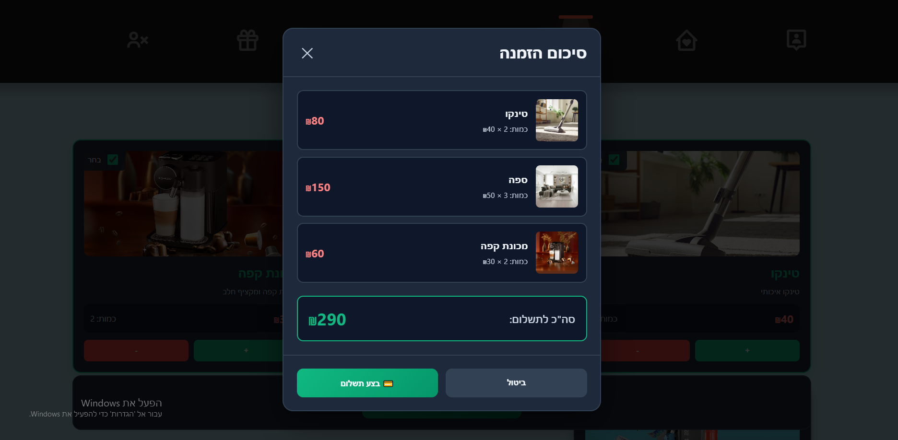
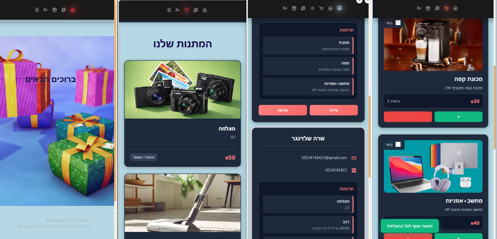

# Chinese Auction Management System

A sophisticated Full-Stack application designed to manage community auctions, featuring a high-fidelity user interface and a robust backend infrastructure.

## 🛠 Tech Stack

*   **Frontend:** Angular (utilizing PrimeNG for professional UI components)
*   **Backend:** .NET C# Web API
*   **Database:** SQL Server (leveraging complex Stored Procedures)
*   **DevOps:** Docker containerization and Git version control

## 🏗 Project Architecture

This project follows a **Monorepo** structure to ensure seamless synchronization between the client and server:

*   `/client` - Angular frontend application
*   `/server` - .NET API backend services

## 🌟 Key Features

*   **Employment Termination Module:** Integrated "Siyum Haasaka" system with complex data binding.
*   **Performance Optimization:** Implementation of Distributed Caching using the Cache-Aside pattern.
*   **Pixel-Perfect Design:** Responsive UI built with strict adherence to Figma design specifications.
*   **Localization:** Support for Hebrew typography including Heebo and Noto Sans Hebrew.
*   **Clean Code:** Manual authorization header management (bypassing global interceptors for granular control).

## 🚀 Getting Started

1.  **Clone the repository:**
    ```bash
    git clone https://github.com/Sara-gitCount/mechina-sinit-app.git
2.  **client setup:**
    ```bash
    cd client
    npm install
    ng serve

3.  **Server Setup:**
    *   Open the `.sln` file in Visual Studio.
    *   Update the connection string in `appsettings.json`.
    *   Run the project.

## 📸 Screenshots

📸 Project Screenshots


Gifts Selection


Donors Management


Payment Process


📱 Mobile Responsiveness
The system is fully responsive, ensuring a smooth user experience across all devices, from desktops to mobile phones.

Mobile View

